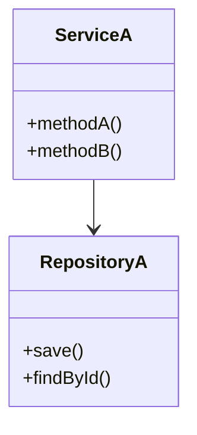
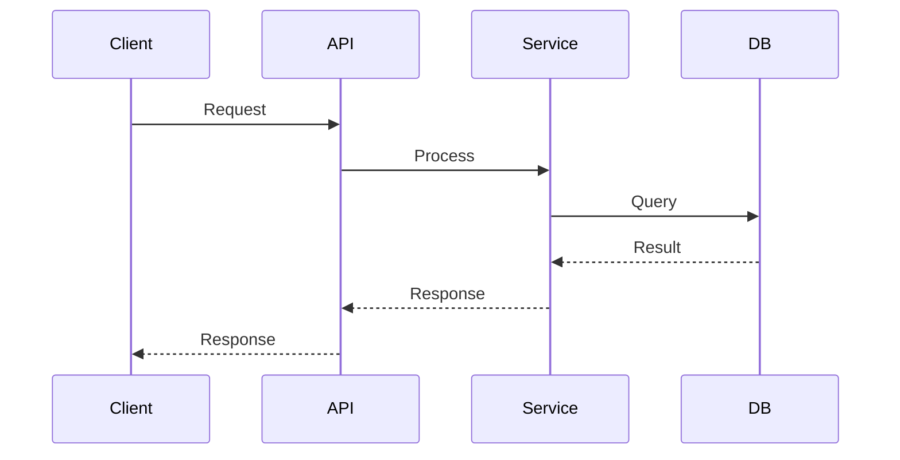

# 模块技术设计文档 (Technical Design)

**模块名称**: [Module Name]
**作者**: [Author]
**日期**: [YYYY-MM-DD]

---

## 1. 设计概述 (Overview)
> [简述实现思路，采用的设计模式 (如: 策略模式、工厂模式、观察者模式等)]

## 2. 类/模块设计 (Class/Module Design)

### 2.1 架构图 (Architecture Diagram)
> [建议使用 Mermaid 或 PlantUML]


### 2.2 核心组件说明
- **[ComponentName]**: 职责描述...
- **[InterfaceName]**: 接口定义...

## 3. 数据库设计 (Database Design)

### 3.1 表结构 (Table Schema)

**Table: `table_name`**

| 字段名 | 类型 | 长度 | 是否为空 | 默认值 | 备注 |
| :--- | :--- | :--- | :--- | :--- | :--- |
| id | [类型] | [长度] | NO | | 主键 |
| [field] | [类型] | [长度] | NO | | [说明] |
| status | [类型] | [长度] | NO | 0 | 状态 |
| created_at | [类型] | | NO | NOW() | 创建时间 |

### 3.2 查询示例
```sql
SELECT * FROM table_name WHERE [condition]
```

## 4. 接口设计 (API Design)

### 4.1 接口 A: [Description]
- **URL**: `[METHOD] /api/v1/resource`
- **Request Body**:
```json
{
  "field": "value"
}
```
- **Response**:
```json
{
  "code": 200,
  "data": { ... }
}
```

## 5. 时序图 (Sequence Diagram)
> [描述关键业务流程的时序]


## 6. 错误处理 (Error Handling)

| 错误码 | 描述 | 处理方式 |
| :--- | :--- | :--- |
| [code] | [description] | [handling] |
